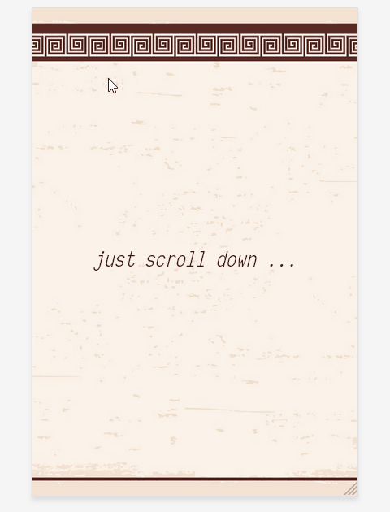

# Random Quotes

The app that allows users to see sayings of great people simply by visiting its [website](https://ayveezub.github.io/random-quotes/) and scrolling down.

- Simple vanilla JS/CSS static site

- **ES modules**

- **Intersection Observer API**



## Getting Started

To clone and run this application, you'll need *Git*, *Node.js* (which comes with *npm*) and *http-server* (`npm i http-server`) installed on your computer.
From your command line:

```
# Clone this repository
$ git clone git@github.com:ayveezub/random-quotes.git

# Go into the repository
$ cd random-quotes

# Install dependencies
$ npm i

# Run the app
$ http-server
```
